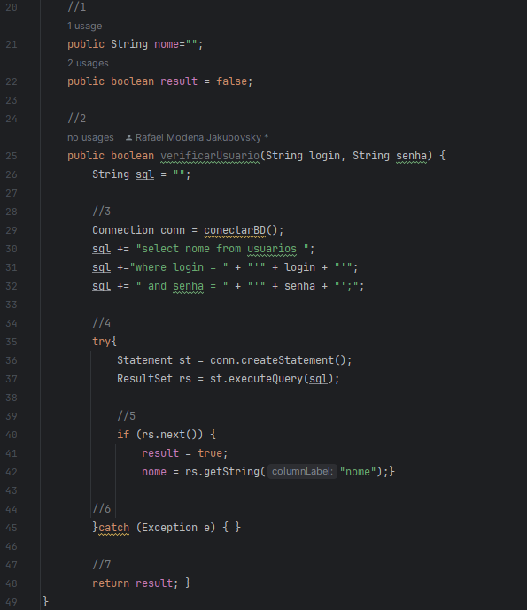
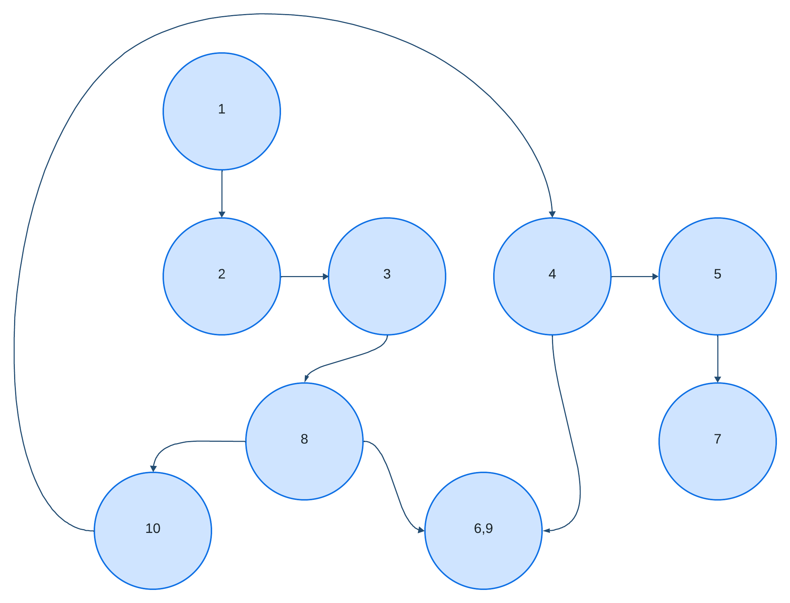

# Exercício individual - Teste de Caixa Branca (ETAPA 2)

## Descrição
O projeto foi desenvolvido na IDE IntelliJ, consiste em um código simples para colocar em prova o conhecimento em testes de software, realizando o teste de caixa branca e indicando problemas.

## Relatório

## Grafo de Fluxo

## Cálculo de Complexidade Ciclomática

<b>E: Arestas, N: Nós</b> 
(<i>V(G) = E – N + 2</i>)

V(G) = 7 - 7 + 2 
V(G) = 2

<b>O resultado da Complexidade Ciclomática é 2</b>

## Publicação
https://github.com/Rafael-MJ/TesteCaixaBranca

## Última atualização 04/10/23
