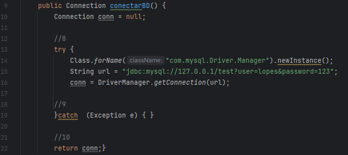

# Exercício individual - Teste de Caixa Branca (ETAPA 2)

## Descrição
O projeto foi desenvolvido na IDE IntelliJ, consiste em um código simples para colocar em prova o conhecimento em testes de software, realizando o teste de caixa branca e indicando problemas.

## Grafo de Fluxo

## Numeração do Código

## Cálculo de Complexidade Ciclomática

<b>E: Arestas, N: Nós</b> 
(<i>V(G) = E – N + 2</i>)

V(G) = 9 - 9 + 2 
V(G) = 2

<b>O resultado da Complexidade Ciclomática é 2</b>

## Caminhos

<b>[1-2-3-8-9] 
[1-2-3-8-10-4-5-7] 
[1-2-3-8-10-4-6] 
</b>

## Publicação
https://github.com/Rafael-MJ/TesteCaixaBranca

## Última atualização 05/10/23
