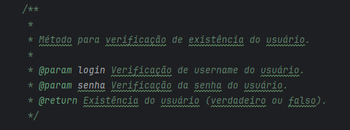
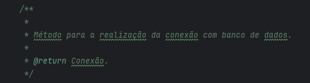

# Exercício individual - Teste de Caixa Branca (ETAPA 3)

## Descrição
O projeto foi desenvolvido na IDE IntelliJ, consiste em um código simples para colocar em prova o conhecimento em testes de software, elaborando toda sua a documentação.

## Exemplos de Documentação

## Publicação
https://github.com/Rafael-MJ/TesteCaixaBranca

## Última atualização 11/10/23
